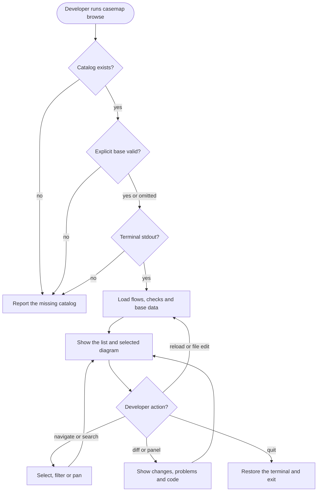

# Browse the catalog

A developer explores use cases, pans wide diagrams and inspects changes in a terminal.

```mermaid
flowchart TD
    who([Developer runs casemap browse]) --> catalog{Catalog exists?}
    catalog -->|no| fail[Report the missing catalog]
    catalog -->|yes| base{Explicit base valid?}
    base -->|no| fail
    base -->|yes or omitted| tty{Terminal stdout?}
    tty -->|no| fail
    tty -->|yes| load[Load flows, checks and base data]
    load --> screen[Show the list and selected diagram]
    screen --> action{Developer action?}
    action -->|navigate or search| view[Select, filter or pan]
    view --> screen
    action -->|diff or panel| details[Show changes, problems and code]
    details --> screen
    action -->|reload or file edit| load
    action -->|quit| restore[Restore the terminal and exit]
    %% @code * src/browse
```
