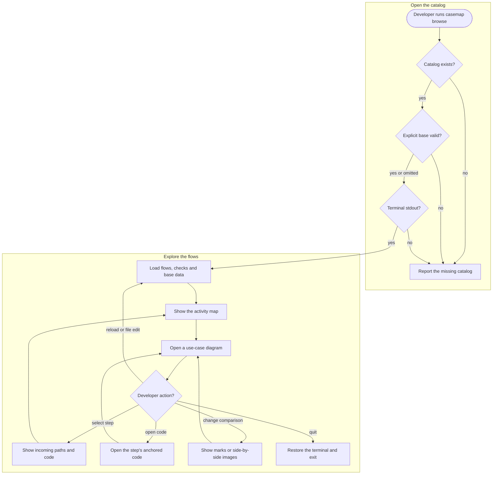

# Browse the catalog

A developer browses the activity map, follows incoming paths and opens the code for a step.

```mermaid
flowchart TD
    subgraph opening [Open the catalog]
        who([Developer runs casemap browse]) --> catalog{Catalog exists?}
        catalog -->|no| fail[Report the missing catalog]
        catalog -->|yes| base{Explicit base valid?}
        base -->|no| fail
        base -->|yes or omitted| tty{Terminal stdout?}
        tty -->|no| fail
    end
    subgraph exploration [Explore the flows]
        load[Load flows, checks and base data] --> screen[Show the activity map]
        screen --> view[Open a use-case diagram]
        view --> action{Developer action?}
        action -->|select step| details[Show incoming paths and code]
        details --> screen
        action -->|open code| open[Open the step's anchored code]
        open --> view
        action -->|change comparison| compare[Show marks or side-by-side images]
        compare --> view
        action -->|reload or file edit| load
        action -->|quit| restore[Restore the terminal and exit]
    end
    tty -->|yes| load
    %% @icon fail triangle-alert
    %% @icon load folder-open
    %% @icon screen monitor
    %% @icon view search
    %% @icon details git-compare
    %% @icon open code
    %% @icon compare git-compare
    %% @icon restore terminal
    %% @code * src/browse
```
