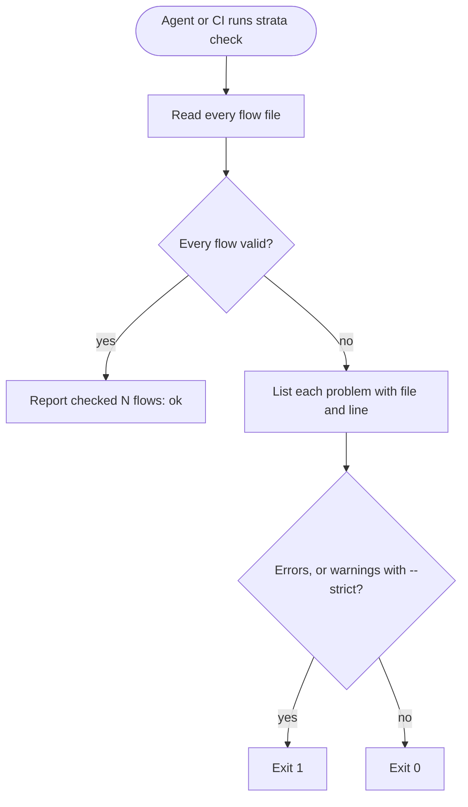

# Check the catalog

A developer or an agent validates every flow before committing, locally or in CI.

```mermaid
flowchart TD
    who([Agent or CI runs strata check]) --> read[Read every flow file]
    read --> rules{Every flow valid?}
    rules -->|yes| ok[Report checked N flows: ok]
    rules -->|no| report[List each problem with file and line]
    report --> strict{Errors, or warnings with --strict?}
    strict -->|yes| fail[Exit 1]
    strict -->|no| pass[Exit 0]
```
