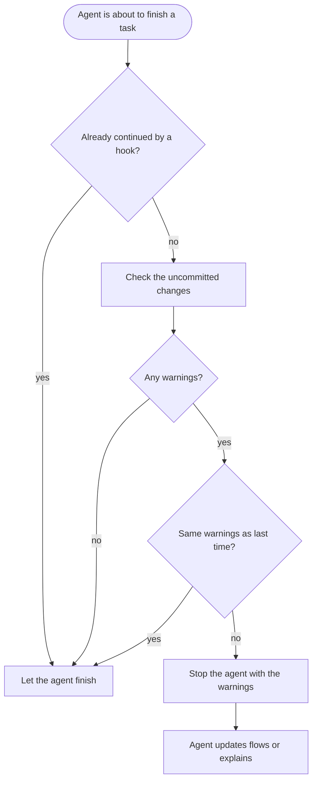

# Keep the map true

A coding agent finishing a task is stopped once when its changes left the use-case map out of date.

```mermaid
flowchart TD
    agent([Agent is about to finish a task]) --> active{Already continued by a hook?}
    active -->|yes| done[Let the agent finish]
    active -->|no| look[Check the uncommitted changes]
    look --> found{Any warnings?}
    found -->|no| done
    found -->|yes| seen{Same warnings as last time?}
    seen -->|yes| done
    seen -->|no| stop[Stop the agent with the warnings]
    stop --> fix[Agent updates flows or explains]
    %% @code * src/hook.rs
```
