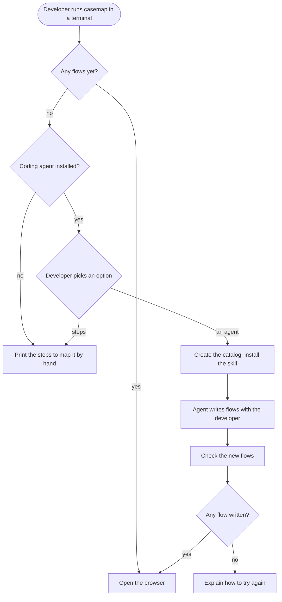

# Map a new repository

A developer runs casemap in a repository without flows and lets a coding agent write them.

```mermaid
flowchart TD
    dev([Developer runs casemap in a terminal]) --> map{Any flows yet?}
    map -->|yes| browse[Open the browser]
    map -->|no| agents{Coding agent installed?}
    agents -->|no| steps[Print the steps to map it by hand]
    agents -->|yes| menu{Developer picks an option}
    menu -->|an agent| init[Create the catalog, install the skill]
    menu -->|steps| steps
    init --> work[Agent writes flows with the developer]
    work --> check[Check the new flows]
    check --> written{Any flow written?}
    written -->|yes| browse
    written -->|no| retry[Explain how to try again]
    %% @code * src/onboard.rs
    %% @code init src/main.rs
```
