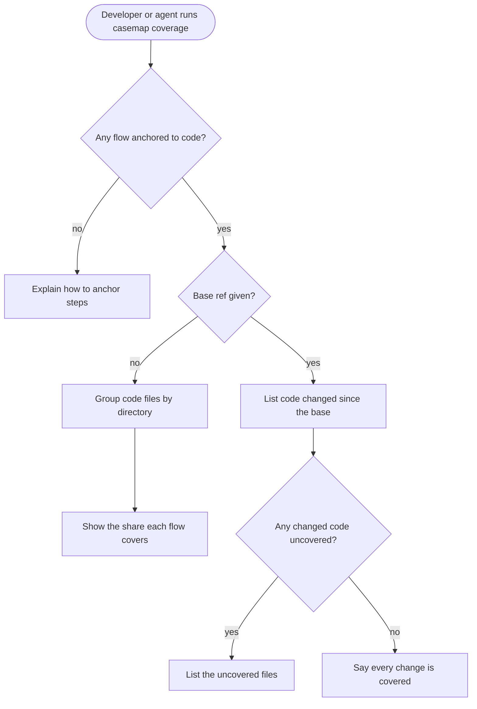

# Measure coverage

A developer or an agent finds the code that no use-case flow covers, in the whole repository or in a branch.

```mermaid
flowchart TD
    who([Developer or agent runs casemap coverage]) --> anchors{Any flow anchored to code?}
    anchors -->|no| hint[Explain how to anchor steps]
    anchors -->|yes| mode{Base ref given?}
    mode -->|no| repo[Group code files by directory]
    repo --> share[Show the share each flow covers]
    mode -->|yes| changed[List code changed since the base]
    changed --> gaps{Any changed code uncovered?}
    gaps -->|yes| list[List the uncovered files]
    gaps -->|no| ok[Say every change is covered]
    %% @code * src/coverage.rs
```
