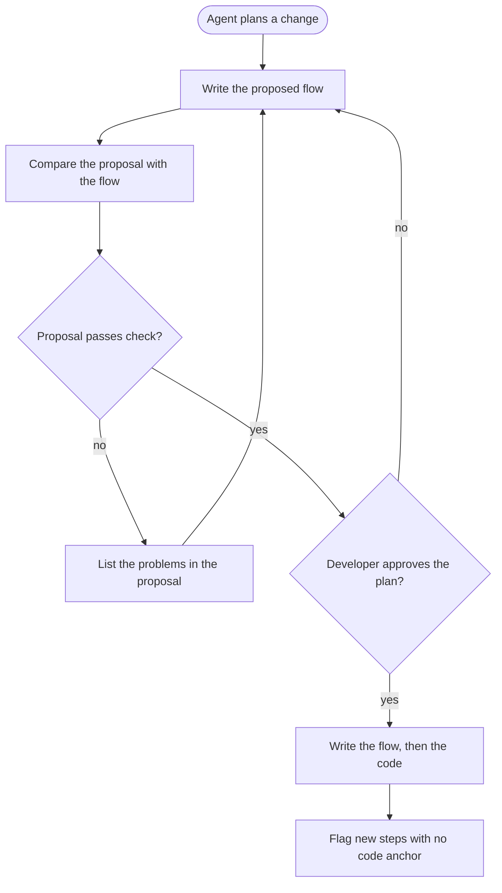

# Plan a change

A developer and their agent review how a planned change alters a use case before any code is written.

```mermaid
flowchart TD
    plan([Agent plans a change]) --> write[Write the proposed flow]
    write --> preview[Compare the proposal with the flow]
    preview --> valid{Proposal passes check?}
    valid -->|no| errors[List the problems in the proposal]
    errors --> write
    valid -->|yes| review{Developer approves the plan?}
    review -->|no| write
    review -->|yes| save[Write the flow, then the code]
    save --> anchor[Flag new steps with no code anchor]
    %% @code preview src/main.rs
    %% @code anchor src/flows.rs
```
