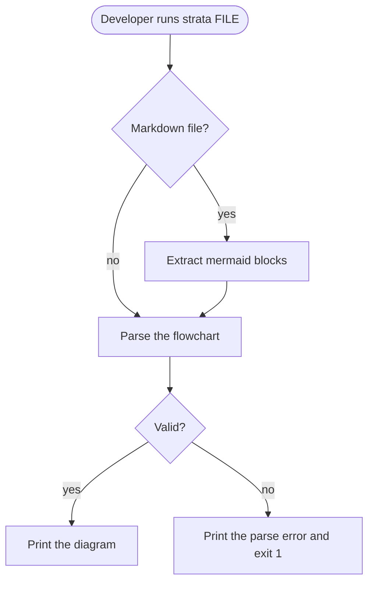

# Render a diagram

A developer points strata at a Mermaid or Markdown file and gets the diagram in the terminal.

```mermaid
flowchart TD
    dev([Developer runs strata FILE]) --> kind{Markdown file?}
    kind -->|no| parse[Parse the flowchart]
    kind -->|yes| blocks[Extract mermaid blocks]
    blocks --> parse
    parse --> ok{Valid?}
    ok -->|yes| draw[Print the diagram]
    ok -->|no| error[Print the parse error and exit 1]
    %% @code parse src/parser.rs
    %% @code blocks src/markdown.rs
    %% @code draw src/render.rs src/canvas.rs src/layout src/route.rs
```
