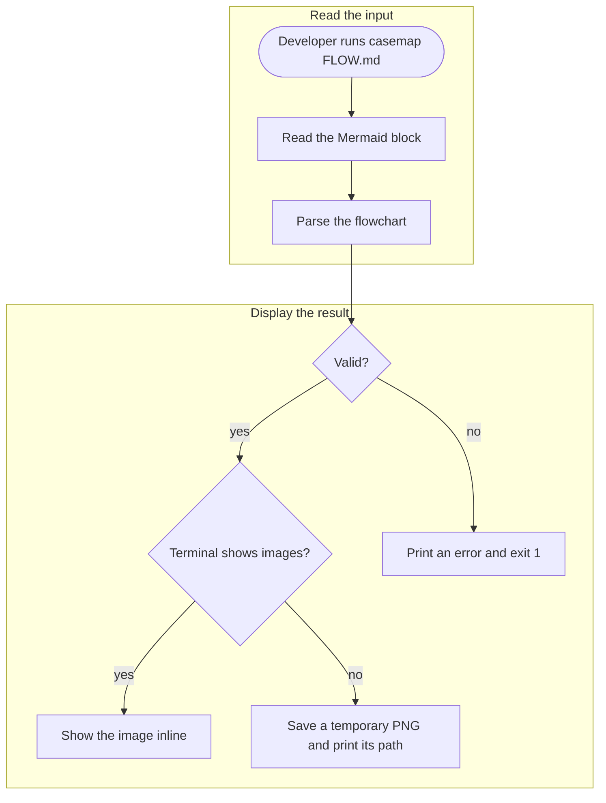

# Render a diagram

A developer opens a Markdown use-case flow and gets an image of its diagram.

```mermaid
flowchart TD
    subgraph input [Read the input]
        dev([Developer runs casemap FLOW.md]) --> blocks[Read the Mermaid block]
        blocks --> parse
        parse[Parse the flowchart]
    end
    subgraph outcome [Display the result]
        ok{Valid?} -->|yes| graphics{Terminal shows images?}
        ok -->|no| error[Print an error and exit 1]
        graphics -->|yes| draw[Show the image inline]
        graphics -->|no| save[Save a temporary PNG and print its path]
    end
    parse --> ok
    %% @icon blocks file
    %% @icon parse scan
    %% @icon draw image
    %% @icon save download
    %% @icon error triangle-alert
    %% @code parse src/parser.rs
    %% @code blocks src/markdown.rs
    %% @code draw src/flow_image src/image_terminal.rs
    %% @code save src/image_terminal.rs
```
