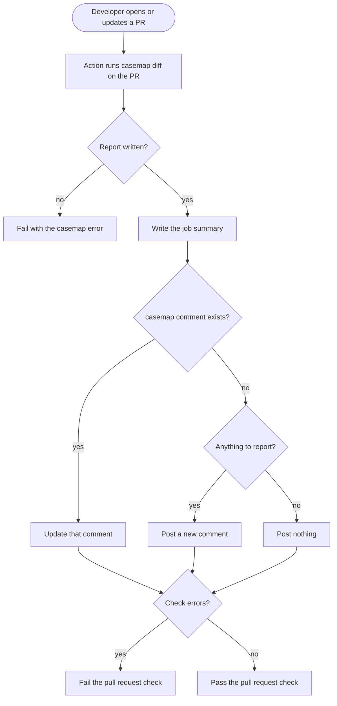

# Review a pull request

A reviewer opens a pull request and sees which use cases it changed, drawn in a casemap comment.

```mermaid
flowchart TD
    pr([Developer opens or updates a PR]) --> run[Action runs casemap diff on the PR]
    run --> ok{Report written?}
    ok -->|no| fail[Fail with the casemap error]
    ok -->|yes| summary[Write the job summary]
    summary --> own{casemap comment exists?}
    own -->|yes| update[Update that comment]
    own -->|no| news{Anything to report?}
    news -->|yes| post[Post a new comment]
    news -->|no| skip[Post nothing]
    update --> errors{Check errors?}
    post --> errors
    skip --> errors
    errors -->|yes| red[Fail the pull request check]
    errors -->|no| green[Pass the pull request check]
    %% @code * action.yml
    %% @code run src/flows.rs src/mermaid.rs
```
