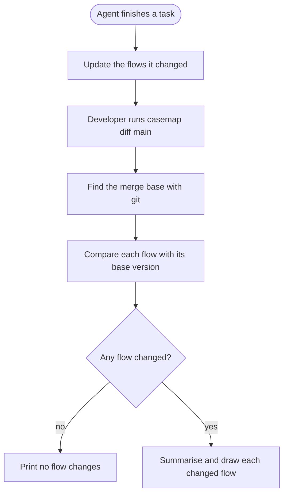

# Review flow changes

After an agent's task, the developer sees which use cases changed and how.

```mermaid
flowchart TD
    agent([Agent finishes a task]) --> update[Update the flows it changed]
    update --> dev[Developer runs casemap diff main]
    dev --> base[Find the merge base with git]
    base --> compare[Compare each flow with its base version]
    compare --> any{Any flow changed?}
    any -->|no| none[Print no flow changes]
    any -->|yes| report[Summarise and draw each changed flow]
    %% @code base src/git.rs
    %% @code compare src/diff.rs src/flows.rs
```
