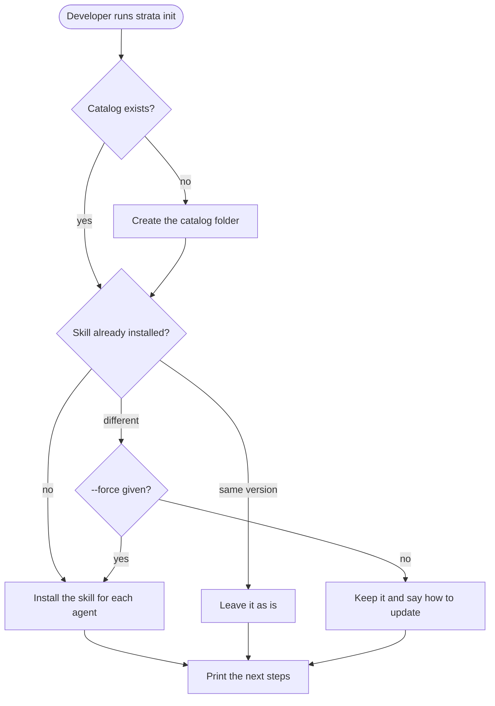

# Set up a catalog

A developer runs strata init in a repository and gets a flow catalog and the agent skill installed.

```mermaid
flowchart TD
    dev([Developer runs strata init]) --> dir{Catalog exists?}
    dir -->|no| create[Create the catalog folder]
    dir -->|yes| skill{Skill already installed?}
    create --> skill
    skill -->|no| install[Install the skill for each agent]
    skill -->|same version| keep[Leave it as is]
    skill -->|different| force{--force given?}
    force -->|yes| install
    force -->|no| warn[Keep it and say how to update]
    install --> next[Print the next steps]
    keep --> next
    warn --> next
```
