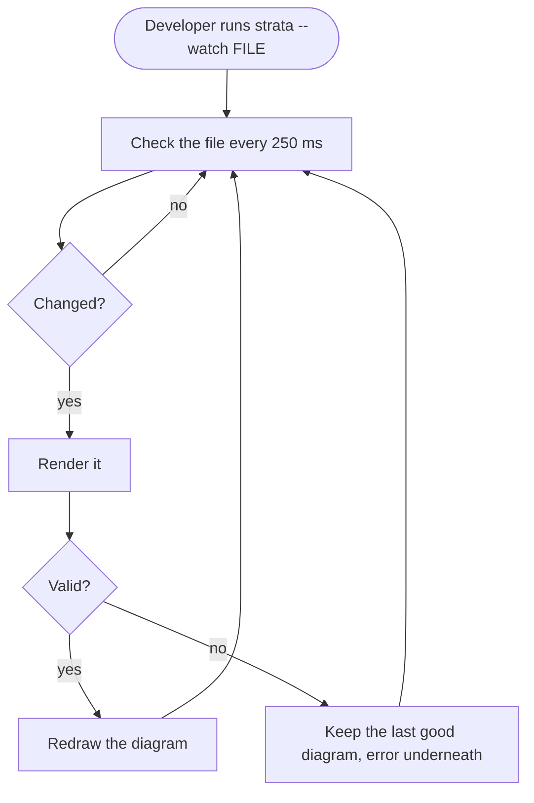

# Watch a diagram

The diagram redraws on every save; a broken edit keeps the last good drawing on screen.

```mermaid
flowchart TD
    dev([Developer runs strata --watch FILE]) --> poll[Check the file every 250 ms]
    poll --> changed{Changed?}
    changed -->|no| poll
    changed -->|yes| render[Render it]
    render --> ok{Valid?}
    ok -->|yes| show[Redraw the diagram]
    ok -->|no| keep[Keep the last good diagram, error underneath]
    show --> poll
    keep --> poll
```
