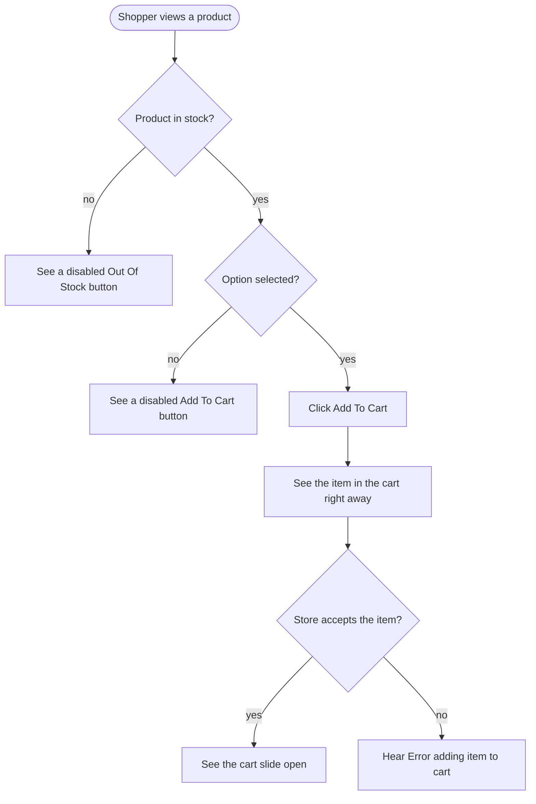

# Add an item to the cart

A shopper adds the selected variant of a product to the cart and sees the cart open.

```mermaid
flowchart TD
    start([Shopper views a product]) --> stock{Product in stock?}
    stock -->|no| oos[See a disabled Out Of Stock button]
    stock -->|yes| sel{Option selected?}
    sel -->|no| need[See a disabled Add To Cart button]
    sel -->|yes| add[Click Add To Cart]
    add --> shown[See the item in the cart right away]
    shown --> saved{Store accepts the item?}
    saved -->|yes| open[See the cart slide open]
    saved -->|no| err[Hear Error adding item to cart]
    %% @code stock components/cart/add-to-cart.tsx
    %% @code saved components/cart/actions.ts
    %% @code open components/cart/modal.tsx
    %% @code shown components/cart/cart-context.tsx
```
