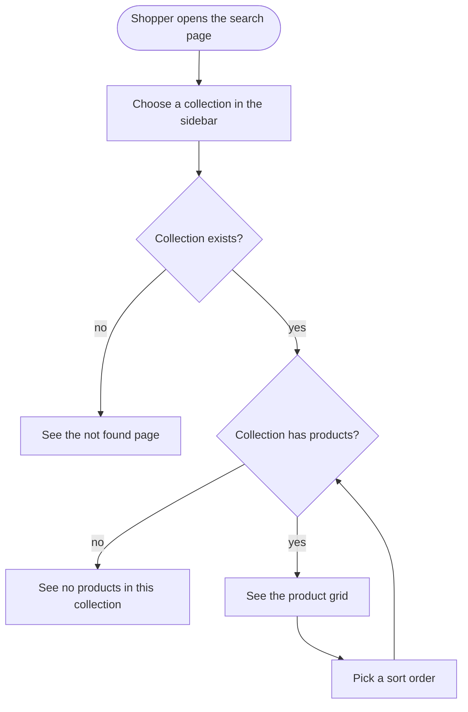

# Browse a collection

A shopper picks a collection from the sidebar and sees its products.

```mermaid
flowchart TD
    start([Shopper opens the search page]) --> pick[Choose a collection in the sidebar]
    pick --> exists{Collection exists?}
    exists -->|no| missing[See the not found page]
    exists -->|yes| products{Collection has products?}
    products -->|no| empty[See no products in this collection]
    products -->|yes| grid[See the product grid]
    grid --> sort[Pick a sort order]
    sort --> products
    %% @code pick components/layout/search/collections.tsx
    %% @code exists app/search/[collection]/page.tsx
    %% @code sort components/layout/search/filter/**
```
