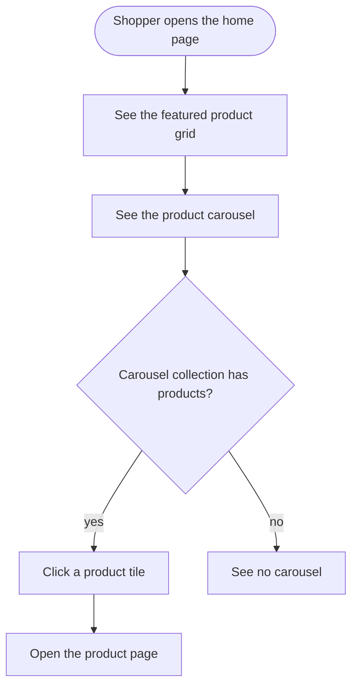

# Browse the storefront

A shopper lands on the home page and sees featured products and a carousel of more.

```mermaid
flowchart TD
    start([Shopper opens the home page]) --> grid[See the featured product grid]
    grid --> carousel[See the product carousel]
    carousel --> has{Carousel collection has products?}
    has -->|yes| pick[Click a product tile]
    has -->|no| none[See no carousel]
    pick --> product[Open the product page]
    %% @code grid components/grid/three-items.tsx
    %% @code carousel components/carousel.tsx
    %% @code product app/product/[handle]/page.tsx
```
