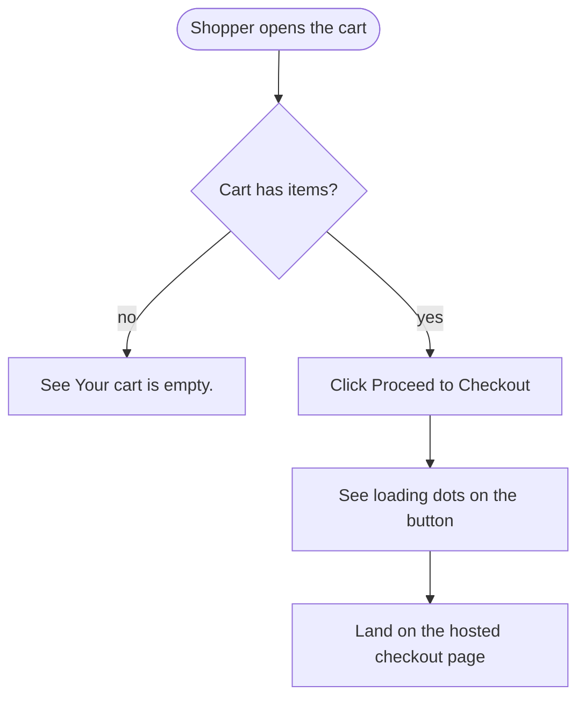

# Check out a cart

A shopper with items in the cart goes to the store's hosted checkout.

```mermaid
flowchart TD
    start([Shopper opens the cart]) --> has{Cart has items?}
    has -->|no| empty[See Your cart is empty.]
    has -->|yes| go[Click Proceed to Checkout]
    go --> wait[See loading dots on the button]
    wait --> pay[Land on the hosted checkout page]
    %% @code go components/cart/modal.tsx
    %% @code pay components/cart/actions.ts
```
