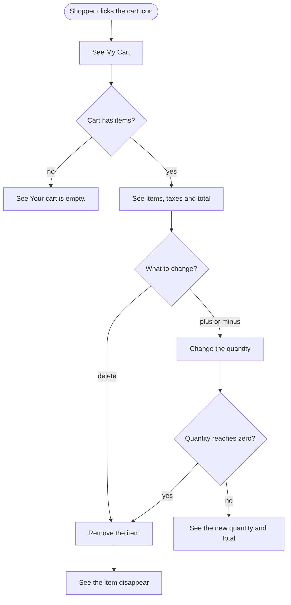

# Manage the cart

A shopper reviews the cart, changes quantities or removes items.

```mermaid
flowchart TD
    start([Shopper clicks the cart icon]) --> open[See My Cart]
    open --> empty{Cart has items?}
    empty -->|no| none[See Your cart is empty.]
    empty -->|yes| lines[See items, taxes and total]
    lines --> act{What to change?}
    act -->|plus or minus| qty[Change the quantity]
    act -->|delete| del[Remove the item]
    qty --> zero{Quantity reaches zero?}
    zero -->|yes| del
    zero -->|no| upd[See the new quantity and total]
    del --> gone[See the item disappear]
    %% @code open components/cart/modal.tsx
    %% @code qty components/cart/edit-item-quantity-button.tsx
    %% @code del components/cart/delete-item-button.tsx
    %% @code upd components/cart/actions.ts
```
