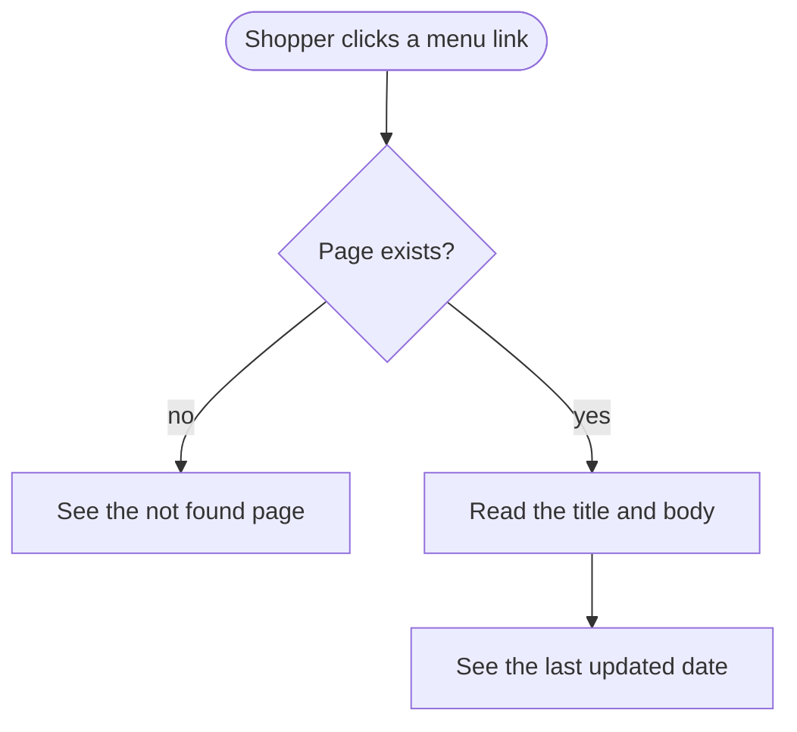

# Read a store page

A shopper opens an info page such as About from the menu or footer.

```mermaid
flowchart TD
    start([Shopper clicks a menu link]) --> exists{Page exists?}
    exists -->|no| missing[See the not found page]
    exists -->|yes| read[Read the title and body]
    read --> updated[See the last updated date]
    %% @code exists app/[page]/page.tsx
    %% @code start components/layout/navbar/index.tsx
    %% @code start components/layout/footer-menu.tsx
```
