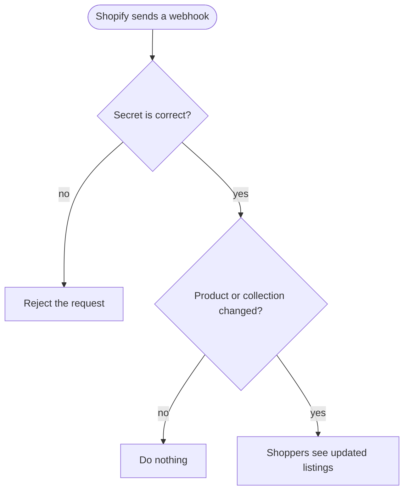

# Refresh the catalogue after a store edit

Shopify tells the storefront a product or collection changed, so shoppers see fresh data.

```mermaid
flowchart TD
    start([Shopify sends a webhook]) --> secret{Secret is correct?}
    secret -->|no| reject[Reject the request]
    secret -->|yes| topic{Product or collection changed?}
    topic -->|no| ignore[Do nothing]
    topic -->|yes| fresh[Shoppers see updated listings]
    %% @code * app/api/revalidate/route.ts
    %% @code secret lib/shopify/index.ts
```
