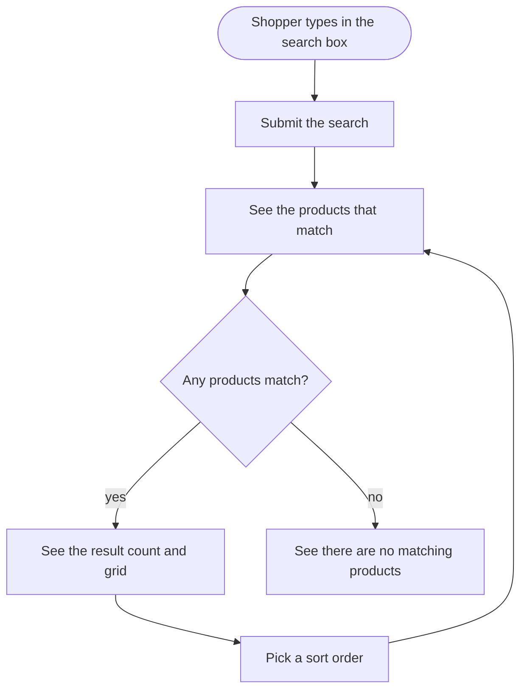

# Search for products

A shopper searches the catalogue by keyword and sorts the results.

```mermaid
flowchart TD
    start([Shopper types in the search box]) --> submit[Submit the search]
    submit --> results[See the products that match]
    results --> found{Any products match?}
    found -->|yes| grid[See the result count and grid]
    found -->|no| empty[See there are no matching products]
    grid --> sort[Pick a sort order]
    sort --> results
    %% @code submit components/layout/navbar/search.tsx
    %% @code results app/search/page.tsx
    %% @code sort components/layout/search/filter/**
    %% @code sort lib/constants.ts
```
