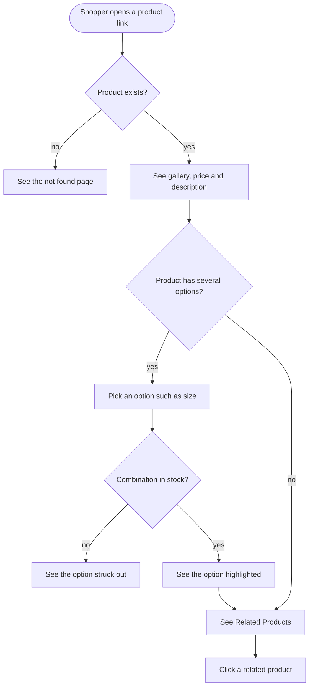

# View a product and choose options

A shopper opens a product, picks its options and sees related products.

```mermaid
flowchart TD
    start([Shopper opens a product link]) --> exists{Product exists?}
    exists -->|no| missing[See the not found page]
    exists -->|yes| page[See gallery, price and description]
    page --> opts{Product has several options?}
    opts -->|yes| choose[Pick an option such as size]
    opts -->|no| related[See Related Products]
    choose --> avail{Combination in stock?}
    avail -->|no| struck[See the option struck out]
    avail -->|yes| selected[See the option highlighted]
    selected --> related
    related --> next[Click a related product]
    %% @code exists app/product/[handle]/page.tsx
    %% @code page components/product/**
    %% @code choose components/product/variant-selector.tsx
```
