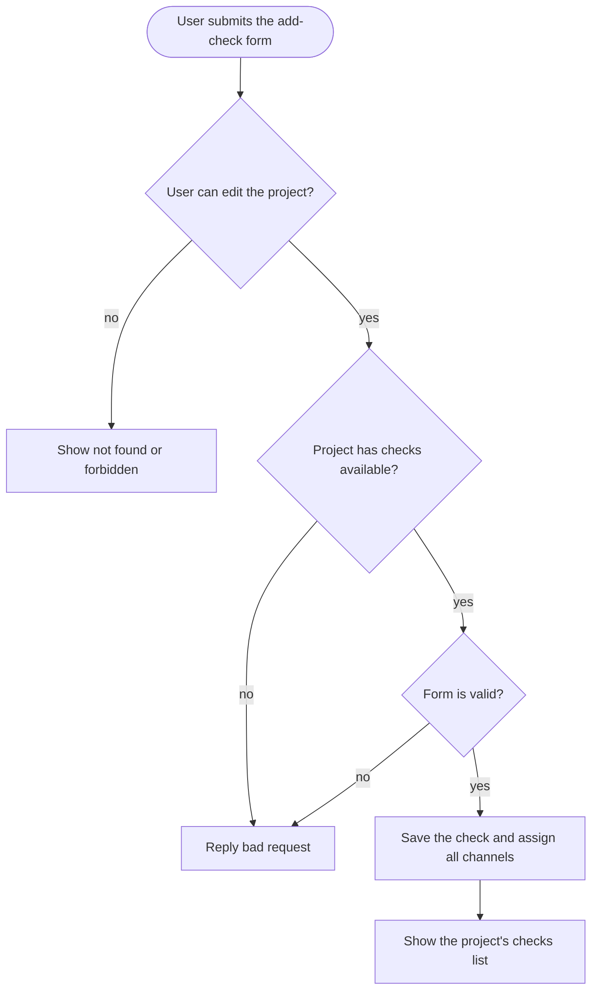

# Add a check

A signed-in user adds a new check to a project and sees it on the checks list.

```mermaid
flowchart TD
    user([User submits the add-check form]) --> access{User can edit the project?}
    access -->|no| denied[Show not found or forbidden]
    access -->|yes| room{Project has checks available?}
    room -->|no| bad[Reply bad request]
    room -->|yes| valid{Form is valid?}
    valid -->|no| bad
    valid -->|yes| save[Save the check and assign all channels]
    save --> list[Show the project's checks list]
    %% @code access hc/front/views.py
    %% @code valid hc/front/forms.py
    %% @code save hc/api/models.py
```
