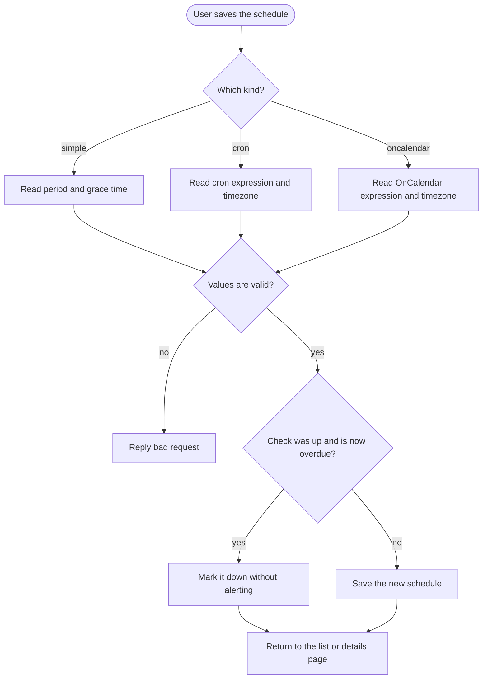

# Change a check's schedule

A user switches a check between a simple period, a cron schedule or an OnCalendar schedule.

```mermaid
flowchart TD
    user([User saves the schedule]) --> kind{Which kind?}
    kind -->|simple| simple[Read period and grace time]
    kind -->|cron| cron[Read cron expression and timezone]
    kind -->|oncalendar| cal[Read OnCalendar expression and timezone]
    simple --> valid{Values are valid?}
    cron --> valid
    cal --> valid
    valid -->|no| bad[Reply bad request]
    valid -->|yes| late{Check was up and is now overdue?}
    late -->|yes| down[Mark it down without alerting]
    late -->|no| save[Save the new schedule]
    down --> back[Return to the list or details page]
    save --> back
    %% @code * hc/front/views.py
    %% @code valid hc/front/forms.py
```
