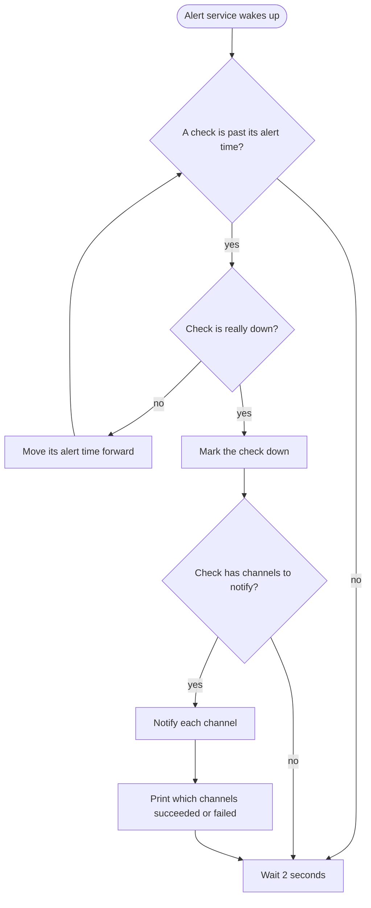

# Get alerted when a check goes down

The alert service notices a missed ping and notifies every channel of the check.

```mermaid
flowchart TD
    clock([Alert service wakes up]) --> late{A check is past its alert time?}
    late -->|no| sleep[Wait 2 seconds]
    late -->|yes| down{Check is really down?}
    down -->|no| later[Move its alert time forward]
    later --> late
    down -->|yes| flip[Mark the check down]
    flip --> chans{Check has channels to notify?}
    chans -->|no| sleep
    chans -->|yes| send[Notify each channel]
    send --> log[Print which channels succeeded or failed]
    log --> sleep
    %% @code late hc/api/management/commands/sendalerts.py
    %% @code send hc/api/management/commands/sendalerts.py
    %% @code send hc/api/transports.py
```
