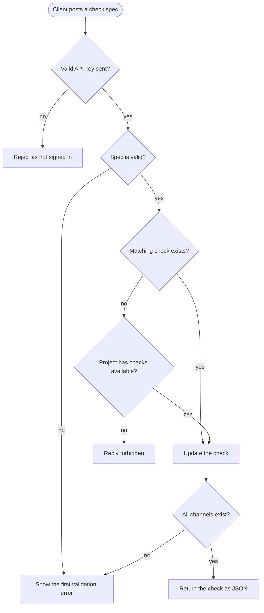

# Manage checks through the API

An API client creates or updates a check and gets its JSON back.

```mermaid
flowchart TD
    client([Client posts a check spec]) --> key{Valid API key sent?}
    key -->|no| reject[Reject as not signed in]
    key -->|yes| spec{Spec is valid?}
    spec -->|no| err[Show the first validation error]
    spec -->|yes| found{Matching check exists?}
    found -->|yes| update[Update the check]
    found -->|no| room{Project has checks available?}
    room -->|no| forbidden[Reply forbidden]
    room -->|yes| update
    update --> chan{All channels exist?}
    chan -->|no| err
    chan -->|yes| json[Return the check as JSON]
    %% @code key hc/api/decorators.py
    %% @code spec hc/api/views.py
    %% @code update hc/api/views.py
```
