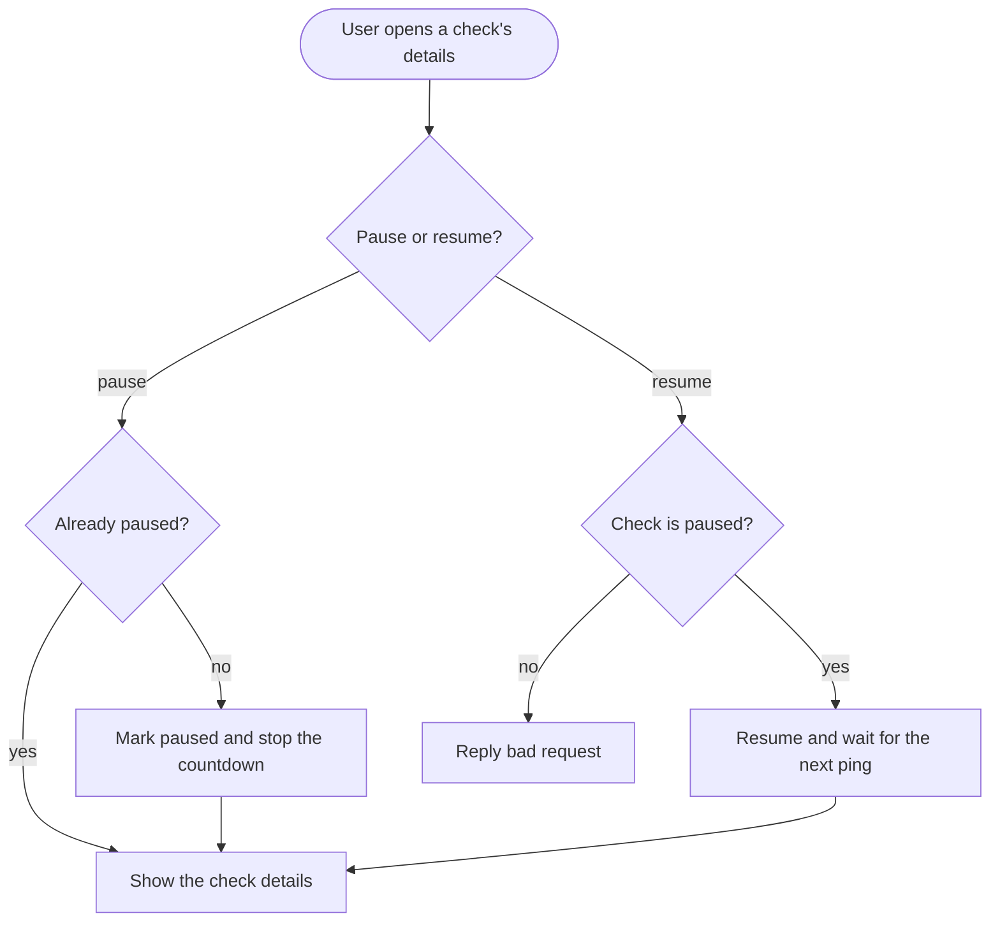

# Pause or resume a check

A user stops a check from alerting, or turns it back on.

```mermaid
flowchart TD
    user([User opens a check's details]) --> action{Pause or resume?}
    action -->|pause| paused{Already paused?}
    paused -->|yes| details[Show the check details]
    paused -->|no| stop[Mark paused and stop the countdown]
    stop --> details
    action -->|resume| resumed{Check is paused?}
    resumed -->|no| bad[Reply bad request]
    resumed -->|yes| go[Resume and wait for the next ping]
    go --> details
    %% @code stop hc/front/views.py
    %% @code go hc/front/views.py
```
