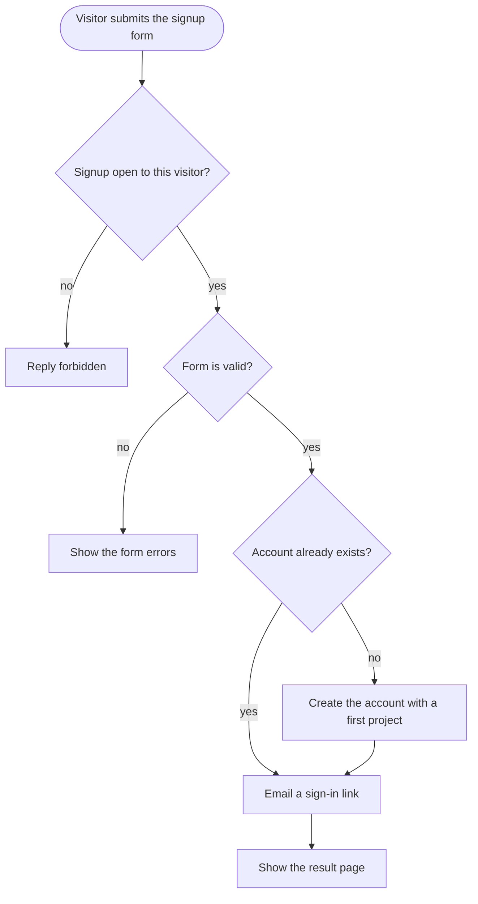

# Sign up for an account

A visitor enters an email address and receives a sign-in link for a new account.

```mermaid
flowchart TD
    visitor([Visitor submits the signup form]) --> open{Signup open to this visitor?}
    open -->|no| forbidden[Reply forbidden]
    open -->|yes| valid{Form is valid?}
    valid -->|no| errors[Show the form errors]
    valid -->|yes| exists{Account already exists?}
    exists -->|no| make[Create the account with a first project]
    exists -->|yes| link[Email a sign-in link]
    make --> link
    link --> done[Show the result page]
    %% @code * hc/accounts/views.py
    %% @code valid hc/accounts/forms.py
```
