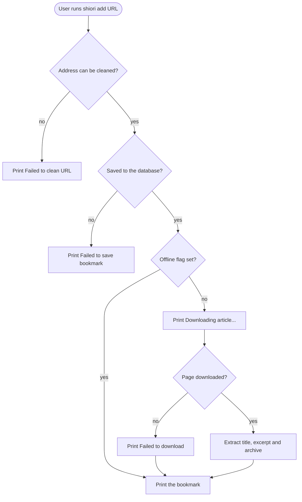

# Add a bookmark from the terminal

A person runs `shiori add URL` to save a page, with optional title, excerpt, tags and archive.

```mermaid
flowchart TD
    run([User runs shiori add URL]) --> clean{Address can be cleaned?}
    clean -->|no| badurl[Print Failed to clean URL]
    clean -->|yes| save{Saved to the database?}
    save -->|no| faildb[Print Failed to save bookmark]
    save -->|yes| offline{Offline flag set?}
    offline -->|yes| show[Print the bookmark]
    offline -->|no| dl[Print Downloading article...]
    dl --> got{Page downloaded?}
    got -->|no| faildl[Print Failed to download]
    faildl --> show
    got -->|yes| proc[Extract title, excerpt and archive]
    proc --> show
    %% @code clean internal/cmd/add.go
    %% @code proc internal/core/processing.go
    %% @code show internal/cmd/utils.go
```
