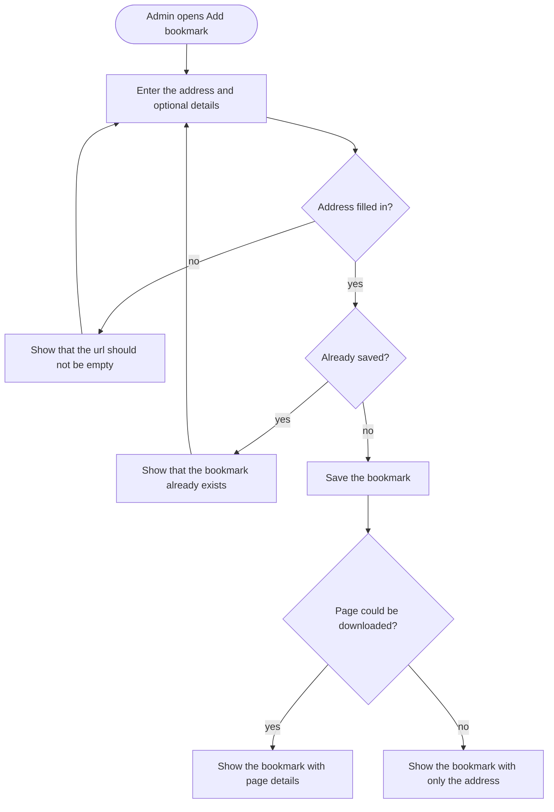

# Add a bookmark

A signed-in admin saves a web address, optionally with a title, excerpt, tags and an offline archive.

```mermaid
flowchart TD
    start([Admin opens Add bookmark]) --> url[Enter the address and optional details]
    url --> empty{Address filled in?}
    empty -->|no| needurl[Show that the url should not be empty]
    needurl --> url
    empty -->|yes| dup{Already saved?}
    dup -->|yes| exists[Show that the bookmark already exists]
    exists --> url
    dup -->|no| saved[Save the bookmark]
    saved --> fetch{Page could be downloaded?}
    fetch -->|yes| done[Show the bookmark with page details]
    fetch -->|no| bare[Show the bookmark with only the address]
    %% @code url webapp/src/views/AddBookmarkView.vue
    %% @code empty internal/http/handlers/api/v1/bookmarks.go
    %% @code saved internal/domains/bookmarks.go
    %% @code fetch internal/core/processing.go
```
