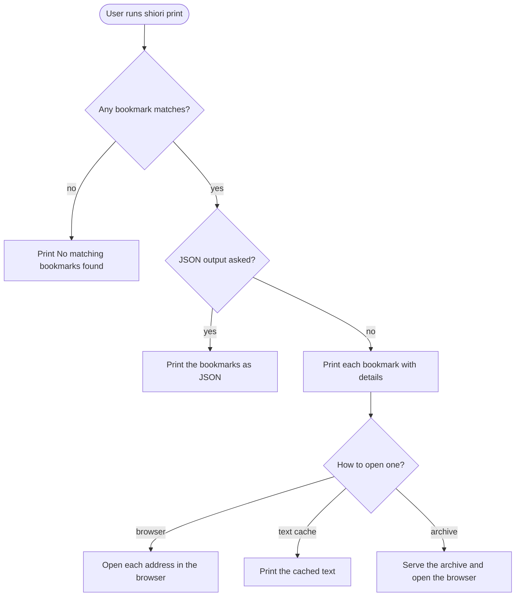

# Find and open bookmarks in the terminal

A person lists saved bookmarks with `shiori print` and opens them in the browser, the archive or the terminal.

```mermaid
flowchart TD
    run([User runs shiori print]) --> any{Any bookmark matches?}
    any -->|no| none[Print No matching bookmarks found]
    any -->|yes| fmt{JSON output asked?}
    fmt -->|yes| json[Print the bookmarks as JSON]
    fmt -->|no| text[Print each bookmark with details]
    text --> mode{How to open one?}
    mode -->|browser| browser[Open each address in the browser]
    mode -->|text cache| term[Print the cached text]
    mode -->|archive| serve[Serve the archive and open the browser]
    %% @code any internal/cmd/print.go
    %% @code mode internal/cmd/open.go
    %% @code text internal/cmd/utils.go
```
