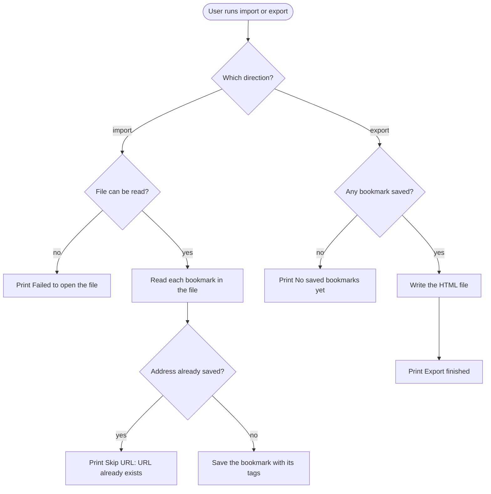

# Import and export bookmarks

A person moves bookmarks in from a browser or Pocket file, or out to an HTML file.

```mermaid
flowchart TD
    run([User runs import or export]) --> dir{Which direction?}
    dir -->|import| open{File can be read?}
    open -->|no| fail[Print Failed to open the file]
    open -->|yes| each[Read each bookmark in the file]
    each --> dup{Address already saved?}
    dup -->|yes| skip[Print Skip URL: URL already exists]
    dup -->|no| store[Save the bookmark with its tags]
    dir -->|export| has{Any bookmark saved?}
    has -->|no| empty[Print No saved bookmarks yet]
    has -->|yes| write[Write the HTML file]
    write --> fin[Print Export finished]
    %% @code each internal/cmd/import.go
    %% @code store internal/cmd/pocket.go
    %% @code write internal/cmd/export.go
```
