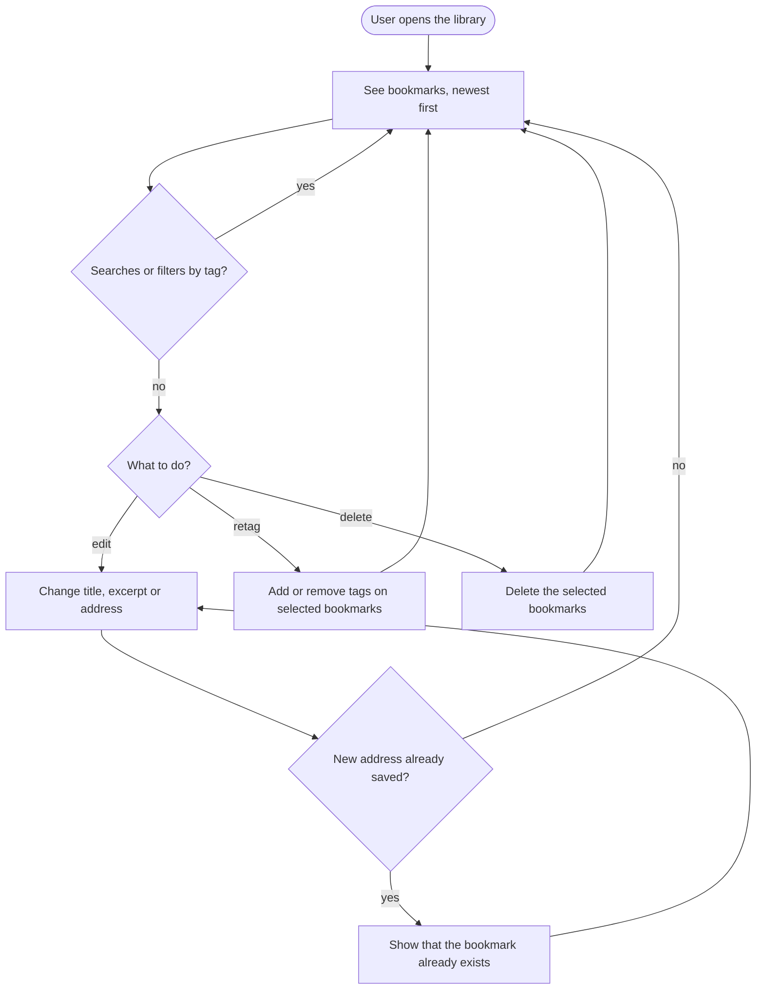

# Manage my bookmarks

A signed-in user browses, searches, edits, retags and deletes bookmarks in the library.

```mermaid
flowchart TD
    start([User opens the library]) --> list[See bookmarks, newest first]
    list --> find{Searches or filters by tag?}
    find -->|yes| list
    find -->|no| act{What to do?}
    act -->|edit| edit[Change title, excerpt or address]
    act -->|retag| tags[Add or remove tags on selected bookmarks]
    act -->|delete| del[Delete the selected bookmarks]
    edit --> taken{New address already saved?}
    taken -->|yes| exists[Show that the bookmark already exists]
    exists --> edit
    taken -->|no| list
    tags --> list
    del --> list
    %% @code list webapp/src/views/LibraryView.vue
    %% @code list internal/http/handlers/api/v1/bookmarks.go
    %% @code taken internal/domains/bookmarks.go
    %% @code tags webapp/src/stores/bookmarks.ts
```
