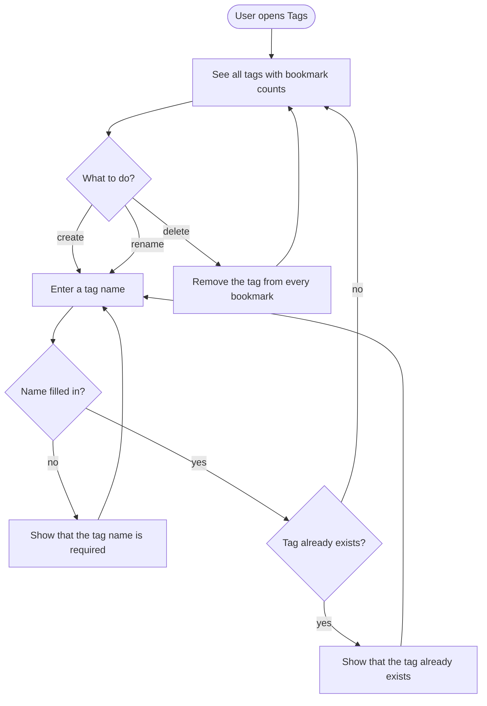

# Manage tags

A signed-in user lists, creates, renames and deletes tags.

```mermaid
flowchart TD
    start([User opens Tags]) --> list[See all tags with bookmark counts]
    list --> act{What to do?}
    act -->|create| name[Enter a tag name]
    act -->|rename| name
    act -->|delete| gone[Remove the tag from every bookmark]
    name --> empty{Name filled in?}
    empty -->|no| need[Show that the tag name is required]
    need --> name
    empty -->|yes| dup{Tag already exists?}
    dup -->|yes| exists[Show that the tag already exists]
    exists --> name
    dup -->|no| list
    gone --> list
    %% @code list webapp/src/views/TagsView.vue
    %% @code name webapp/src/views/AddTagView.vue
    %% @code empty internal/http/handlers/api/v1/tags.go
```
