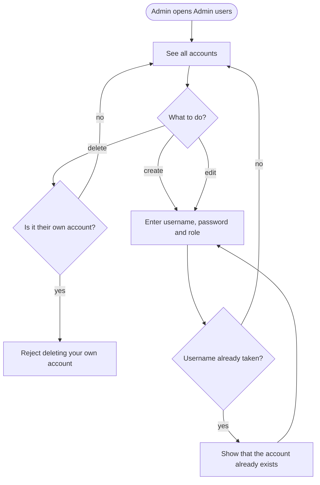

# Manage user accounts

An admin creates, edits and deletes other people's accounts, and any user changes their own password.

```mermaid
flowchart TD
    start([Admin opens Admin users]) --> list[See all accounts]
    list --> act{What to do?}
    act -->|create| form[Enter username, password and role]
    act -->|edit| form
    act -->|delete| self{Is it their own account?}
    self -->|yes| denied[Reject deleting your own account]
    self -->|no| list
    form --> dup{Username already taken?}
    dup -->|yes| taken[Show that the account already exists]
    taken --> form
    dup -->|no| list
    %% @code list webapp/src/views/AdminView.vue
    %% @code self internal/http/handlers/api/v1/accounts.go
    %% @code dup internal/domains/accounts.go
```
