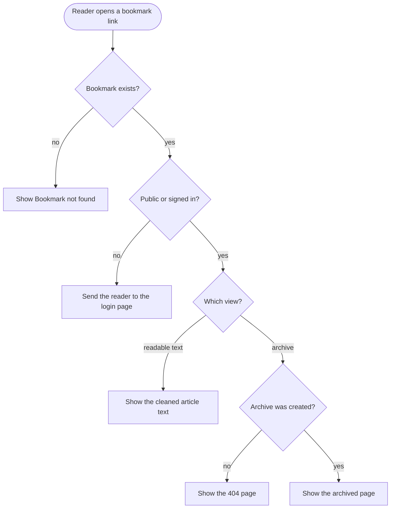

# Read a saved page

Someone opens the cached text or the offline archive of a bookmark and reads it without the original site.

```mermaid
flowchart TD
    start([Reader opens a bookmark link]) --> exists{Bookmark exists?}
    exists -->|no| missing[Show Bookmark not found]
    exists -->|yes| public{Public or signed in?}
    public -->|no| login[Send the reader to the login page]
    public -->|yes| kind{Which view?}
    kind -->|readable text| content[Show the cleaned article text]
    kind -->|archive| hasarc{Archive was created?}
    hasarc -->|no| nf[Show the 404 page]
    hasarc -->|yes| arc[Show the archived page]
    %% @code exists internal/http/handlers/bookmark.go
    %% @code content internal/view/content.html
    %% @code arc internal/view/archive.html
```
