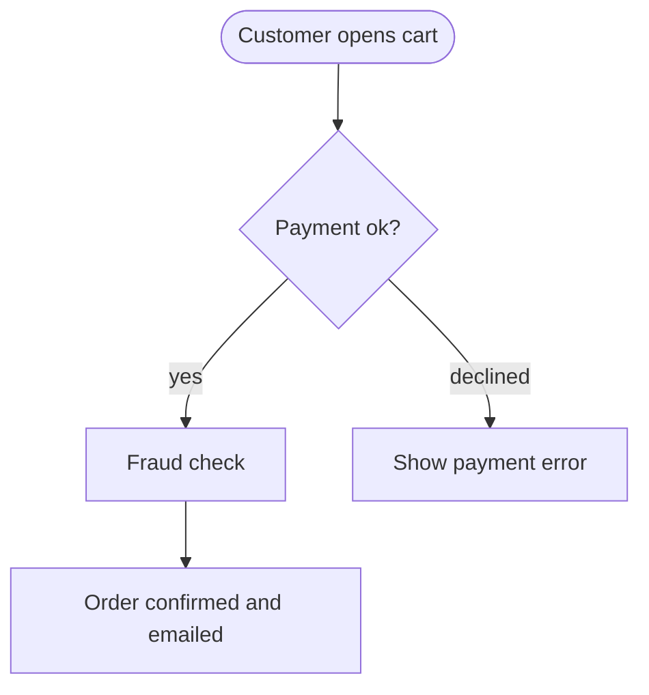

# Checkout

A customer pays for the cart.

```mermaid
flowchart TD
    cart([Customer opens cart]) --> pay{Payment ok?}
    pay -->|yes| fraud[Fraud check]
    fraud --> confirm[Order confirmed and emailed]
    pay -->|declined| error[Show payment error]
```
