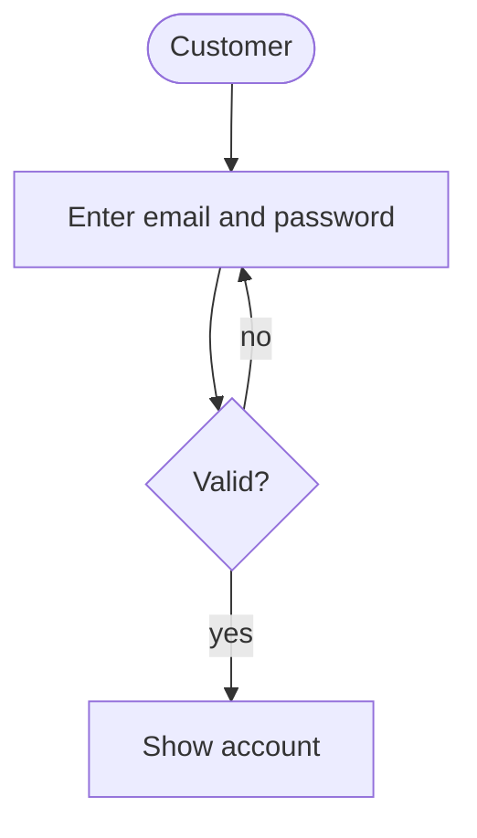

# Login

A returning customer signs in.

```mermaid
flowchart TD
    user([Customer]) --> form[Enter email and password]
    form --> valid{Valid?}
    valid -->|yes| home[Show account]
    valid -->|no| form
```
