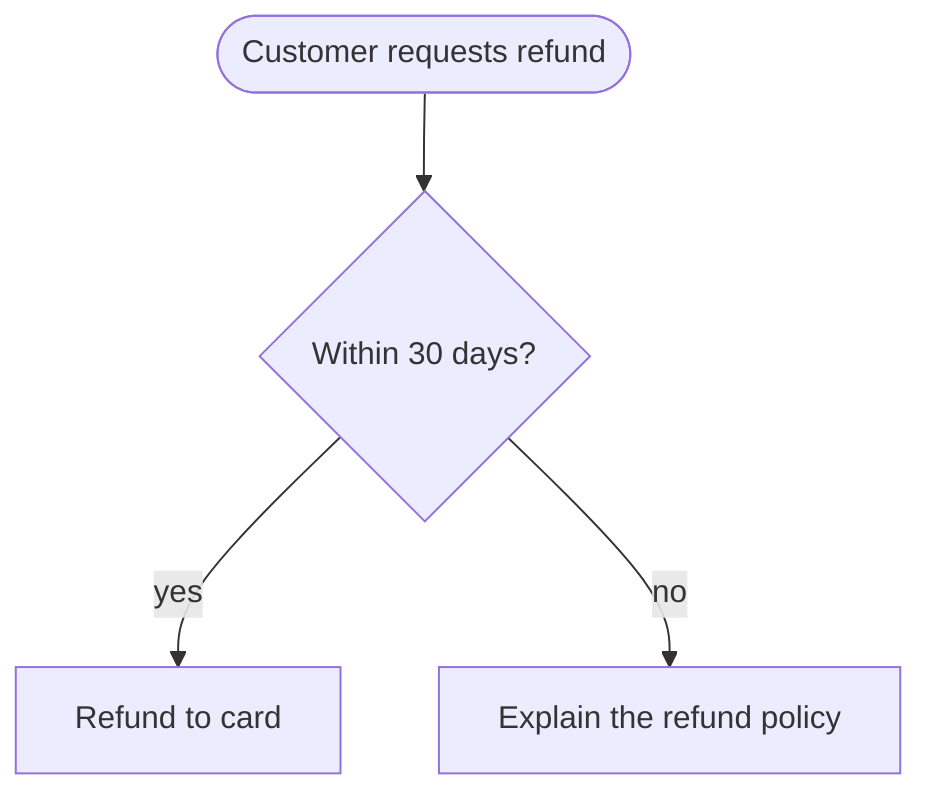

# Refund

A customer asks for a refund and gets the money back or a reason why not.

```mermaid
flowchart TD
    ask([Customer requests refund]) --> check{Within 30 days?}
    check -->|yes| refund[Refund to card]
    check -->|no| reject[Explain the refund policy]
```
