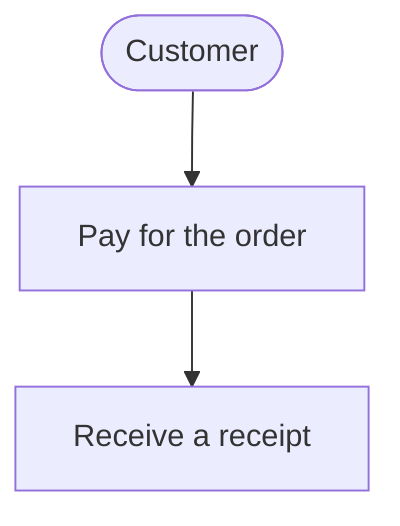

# Pay for an order

A customer pays for an order and receives a receipt.

```mermaid
flowchart TD
    %% @code pay src/pay.rs
    customer([Customer]) --> pay[Pay for the order]
    pay --> receipt[Receive a receipt]
```
