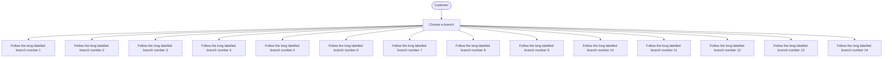

# Wide flow

A customer explores many parallel branches.

```mermaid
flowchart TD
    actor([Customer]) --> choose[Choose a branch]
    choose --> branch1[Follow the long labelled branch number 1]
    choose --> branch2[Follow the long labelled branch number 2]
    choose --> branch3[Follow the long labelled branch number 3]
    choose --> branch4[Follow the long labelled branch number 4]
    choose --> branch5[Follow the long labelled branch number 5]
    choose --> branch6[Follow the long labelled branch number 6]
    choose --> branch7[Follow the long labelled branch number 7]
    choose --> branch8[Follow the long labelled branch number 8]
    choose --> branch9[Follow the long labelled branch number 9]
    choose --> branch10[Follow the long labelled branch number 10]
    choose --> branch11[Follow the long labelled branch number 11]
    choose --> branch12[Follow the long labelled branch number 12]
    choose --> branch13[Follow the long labelled branch number 13]
    choose --> branch14[Follow the long labelled branch number 14]
```
